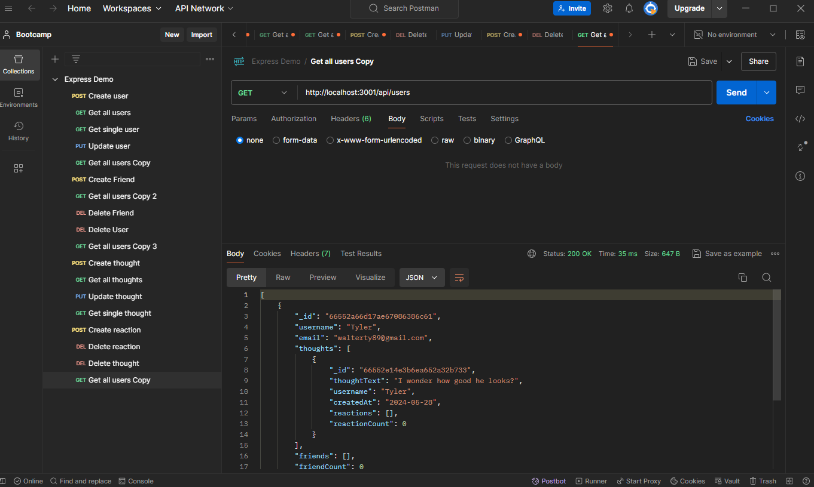

# Social Network

## Description
This application is a mock-up of a social networking API that uses postman to create user data along with thoughts and reactions and properly links those thoughts and reactions to the correct user. You can even use it to mock-up a friends list that properly displays the associated friend with the user. This application is not inteded for actual use and is merely a demonstration of my knowledge thus far using mongoose.

## Visuals
*  Here is a screenshot of a Postman get route.

* [Link to video demonstration](https://drive.google.com/uc?id=15o0T90Qt8NUP3K4uTqGrAjHpIncJrj_B&export=download)

## Usage
This application is a test of my knowledge and abilities to create a social networking API and create all the routes to properly get it going. This is also for grading purposes.

## Acknowledgments
Thank you to 
* [Mongoose](https://www.npmjs.com/package/mongoose)
* [Express](https://www.npmjs.com/package/express)

for allowing me to use their packages.

## Support
If you have any issues with this repo, shoot me an email at walterty89@gmail.com. 

[Here is a link to my GitHub](https://github.com/TyWalter) if you would prefer to contact me this way.